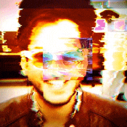

# glitch-profile
A simple glitch effect made with Unity. Essentially an ugly shader that randomizes offsets and color channels based on a set of random squares.

You can check the specific shader [HERE](Assets/Resources/Shaders/GlitchBase.shader)!
